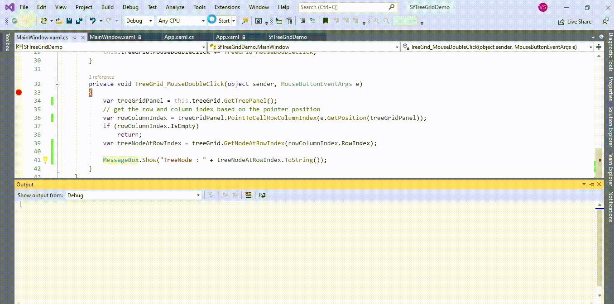

# How to get a tree node in mouse double click event in WPF TreeGrid (SfTreeGrid)?

## About the sample
This example illustrates how to get a tree node in mouse double click event in WPF TreeGrid (SfTreeGrid)

In [SfTreeGrid](https://help.syncfusion.com/cr/wpf/Syncfusion.UI.Xaml.TreeGrid.SfTreeGrid.html), you can get the [TreeNode](https://help.syncfusion.com/cr/wpf/Syncfusion.UI.Xaml.TreeGrid.TreeNode.html) based on row and column index from the mouse pointer position. The [TreeNode](https://help.syncfusion.com/cr/wpf/Syncfusion.UI.Xaml.TreeGrid.TreeNode.html) can be accessed by using any mouse events (example MouseDoubleClick event). This event is triggered when you double click on the [TreeNode](https://help.syncfusion.com/cr/wpf/Syncfusion.UI.Xaml.TreeGrid.TreeNode.html). Within this event, you can access the [TreeGridPanel](https://help.syncfusion.com/cr/wpf/Syncfusion.UI.Xaml.TreeGrid.TreeGridPanel.html) by using the [GetTreePanel()](https://help.syncfusion.com/cr/wpf/Syncfusion.UI.Xaml.TreeGrid.Helpers.TreeGridHelper.html#Syncfusion_UI_Xaml_TreeGrid_Helpers_TreeGridHelper_GetTreePanel_Syncfusion_UI_Xaml_TreeGrid_SfTreeGrid_) extension method that exists in the [Syncfusion.UI.Xaml.TreeGrid.Helpers](https://help.syncfusion.com/cr/wpf/Syncfusion.UI.Xaml.TreeGrid.Helpers.html).

 The row index of [TreeNode](https://help.syncfusion.com/cr/wpf/Syncfusion.UI.Xaml.TreeGrid.TreeNode.html) in the clicked position can be retrieved by resolving the mouse click position through [TreeGridPanel.PointToCellRowColumnIndex](https://help.syncfusion.com/cr/wpf/Syncfusion.UI.Xaml.TreeGrid.TreeGridPanel.html#Syncfusion_UI_Xaml_TreeGrid_TreeGridPanel_PointToCellRowColumnIndex_System_Windows_Point_System_Boolean_). now, you can get the current [TreeNode](https://help.syncfusion.com/cr/wpf/Syncfusion.UI.Xaml.TreeGrid.TreeNode.html) by passing the **RowIndex** in [GetNodeAtRowIndex](https://help.syncfusion.com/cr/wpf/Syncfusion.UI.Xaml.TreeGrid.TreeGridIndexResolver.html#Syncfusion_UI_Xaml_TreeGrid_TreeGridIndexResolver_GetNodeAtRowIndex_Syncfusion_UI_Xaml_TreeGrid_SfTreeGrid_System_Int32_) method in [SfTreeGrid](https://help.syncfusion.com/cr/wpf/Syncfusion.UI.Xaml.TreeGrid.SfTreeGrid.html).


```C#

this.treeGrid.MouseDoubleClick += TreeGrid_MouseDoubleClick;

private void TreeGrid_MouseDoubleClick(object sender, MouseButtonEventArgs e)
{
      var treeGridPanel = this.treeGrid.GetTreePanel();
      // get the row and column index based on the pointer position 
      var rowColumnIndex = treeGridPanel.PointToCellRowColumnIndex(e.GetPosition(treeGridPanel));
      if (rowColumnIndex.IsEmpty)
         return;
      var treeNodeAtRowIndex = treeGrid.GetNodeAtRowIndex(rowColumnIndex.RowIndex);                       
      MessageBox.Show("TreeNode : " + treeNodeAtRowIndex.ToString());
}

```



## Requirements to run the demo
Visual Studio 2015 and above versions


